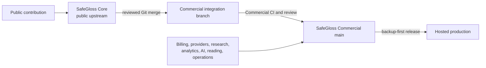

# Relationship between SafeGloss Core and SafeGloss Commercial

## Composition model

SafeGloss Core is the public, vendor-neutral upstream. SafeGloss Commercial
(the private hosted repository, historically named SafeGloss Unified) is the
production downstream and product superset.

Core is not installed into Commercial as a Python package at runtime today. The
two repositories have different concrete models and migration histories, so
Commercial consumes reviewed Core commits through source-level Git merges.
Commercial retains ownership of its production settings, URLs, concrete
models, migrations, and hosted-only behavior. A future vNext compatibility
boundary may permit Commercial to pin an immutable Core GitHub Release artifact
by exact version and SHA-256 digest; it must arrive in a reviewable Commercial
pull request and cannot activate before its model/migration contract is accepted.

Core now ships a dormant, namespaced UUID identity root as one prerequisite for
that future composition. It is not selected by Core's default settings, is not
integrated into Commercial, carries no Hosted entitlement or provider data,
and does not make an artifact-based Commercial update safe by itself. Profile,
membership, domain composition, data migration, release, and downstream pin
updates remain separately reviewed steps.

## Ownership boundary

| Core owns | Commercial owns |
|---|---|
| Vendor-neutral account roles | Hosted identity-provider configuration |
| Courses, rosters, enrollment, join codes | Provider roster integrations |
| Glossaries, terms, translations | AI generation and hosted media workflows |
| Study and Exam Mode semantics | Billing, subscriptions, and entitlements |
| CSV and print delivery | Reading, quizzes, analytics, research, and gamification |
| Public security and deployment contract | Production migration history, deployment, and operations |

Commercial-only code, credentials, customer or research data, provider
payloads, analytics, billing, and production state must never flow into Core.

## Change flow

1. Implement vendor-neutral behavior in Core first.
2. Review Core migrations, tests, security, public documentation, and licensing.
3. Merge the accepted Core change to Core's protected default branch.
4. Merge that exact Core checkpoint into a Commercial integration branch.
5. Resolve differences while preserving Commercial migrations, production
   models, and hosted-only behavior.
6. Run Commercial checks and review Commercial documentation.
7. Merge Commercial through its own gates; only then is the change eligible
   for production deployment.

Commercial's private `docs/deployment/CORE_UPSTREAM.md` is authoritative for
the exact merge baseline, automation, and rollback procedure. This public
document defines the product and source-ownership contract without exposing
private operational details.

## Documentation obligation

A Core change that affects Commercial composition, deployment, operations,
architecture, or user-visible behavior must update the canonical documents in
both repositories during the same workstream. Each repository regenerates and
checks its own structural references. Histories, verification, commits, and
   delivery remain separate and occur in Core-to-Commercial order.
