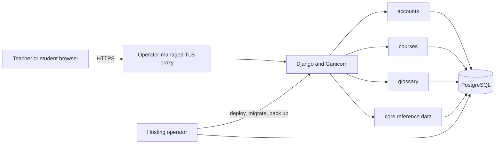
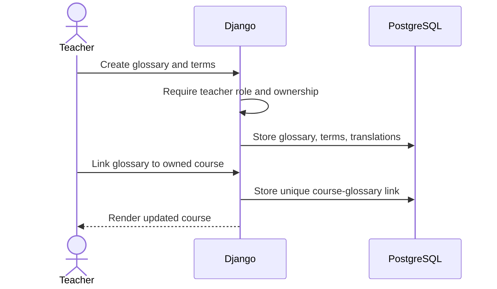
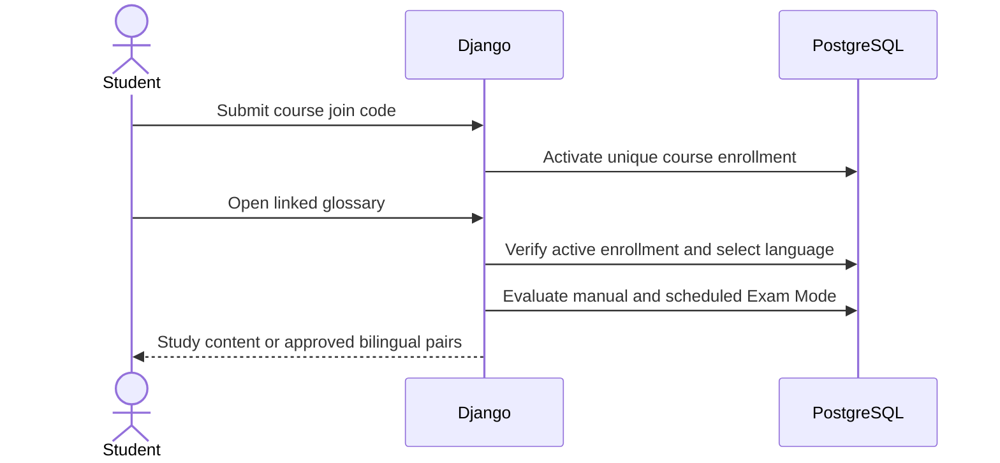

# SafeGloss Core system architecture

## Purpose and boundary

SafeGloss Core is a vendor-neutral, independently self-hostable classroom
application. Teachers author multilingual subject glossaries, connect them to
courses, and manage course access. Students join courses and view glossary
content in a preferred translation language. Study Mode exposes the available
learning context; Exam Mode reduces the response to approved bilingual term
pairs.

Core deliberately excludes billing, behavioral analytics, AI generation,
school-provider integrations, dissertation instrumentation, stories, quizzes,
and hosted production configuration. The accepted boundary and the conditions
for adding features are recorded in [ADR-0001](../decisions/0001-public-core-boundary.md).

## Architectural style

Core is a server-rendered Django modular monolith backed by PostgreSQL. Domain
modules share one process, settings module, database, and release unit. Domain
ownership is kept explicit so optional capabilities can be added without
turning hosted-only concerns into public-core requirements.

The included development Compose file starts PostgreSQL and the Django
development server. A production operator builds the included image, runs
Gunicorn, supplies PostgreSQL and TLS termination, runs migrations as a
release step, and owns backups. The exact committed Compose relationship is
generated in [deployment topology](../generated/deployment-topology.md).

## Domain ownership

| Module | Owns | Depends on |
|---|---|---|
| `accounts` | Email identity, teacher/student/admin role, preferred language | `core.Language` |
| `core` | Language and subject reference data, landing page, dashboard, health response | Django auth relationships exposed by other modules |
| `courses` | Courses, join codes, rosters, enrollment, glossary links, manual and scheduled modes | accounts, core, glossary |
| `glossary` | Glossaries, terms, translations, CSV exchange, student glossary rendering | accounts, core, courses |
| `config` | Settings, root routing, WSGI/ASGI entry points | all installed modules |

The distribution also contains the dormant `safegloss_core_identity` app. It
defines the successor composition's minimal email-login identity root with a
UUID primary key and its own initial migration. It is deliberately absent from
the default `INSTALLED_APPS`, and the default application continues to use
`accounts.User`; therefore installing this version does not switch identity,
create successor tables, or migrate existing accounts. Only isolated contract
settings select the new user model. Activation, legacy-profile extraction, and
data movement are separate reviewed changes.

The current installed-app and cross-app relationship diagram is generated in
[application inventory](../generated/application-inventory.md). Model fields
and relations are generated in [data model](../generated/data-model.md).

## Request path

1. The operator's edge terminates TLS and forwards the request to Django.
2. Django security, session, CSRF, authentication, message, and clickjacking
   middleware establish the request boundary.
3. Root routing delegates to account, course, or glossary routes.
4. Views enforce login, role, ownership, or active enrollment on the server.
5. Models query or update PostgreSQL in the same request.
6. Django renders HTML, emits a redirect, returns CSV, or returns the health
   JSON response.

Core does not require a JavaScript application runtime, background worker,
cache, AI provider, identity provider, analytics service, payment provider, or
object-storage service. The exact current route surface is generated in
[route inventory](../generated/routes.md).

## Primary data flows

### Teacher authoring

### Student access

Detailed user-visible behavior appears in [product workflows](../product/WORKFLOWS.md).

## Persistence and data integrity

PostgreSQL is the canonical database. Important constraints include one
enrollment per course/student, one course/glossary link, unique phrases within
a glossary, and one translation per term/language. A roster assigned to an
enrollment must belong to the same course. A scheduled Exam Mode window must
end after it starts.

The staged identity root uses fixed, namespaced table names and a stable
`sgc_user_email_uq` PostgreSQL constraint. Its first migration depends only on
Django auth. This keeps its schema history independent of the current Core
domain graph and makes future composition explicit rather than coupling it to
the legacy account migration.

The application stores account identifiers and authored classroom data. It
does not ship a production backup scheduler. Operators own database backup,
restore testing, retention, and deletion policies. See the
[deployment guide](../development/DEPLOYMENT.md) and
[security model](../development/SECURITY_MODEL.md).

## Configuration boundary

Configuration enters through environment variables read by Django settings or
the deployment layer. Secret values are never part of generated docs. The
authoritative safe examples are `.env.example`; the generated
[configuration inventory](../generated/configuration.md) lists current variable
names and source locations.

Repository configuration is not live-state evidence. Operators must verify
the running image, environment, database, proxy, backups, and health endpoint
before relying on a deployment.

## Extension rules

An addition belongs in Core when it:

- serves the vendor-neutral glossary or exam-access mission;
- remains useful without a paid or hosted provider account;
- has explicit server-side authorization and privacy behavior;
- includes migrations, tests, documentation, and a sustainable maintenance
  owner; and
- does not import customer data, production state, provider payloads, or
  content without redistribution rights.

Provider-specific features should be optional apps with independent security
and maintenance ownership. Commercial-only concerns remain downstream as
described in [Commercial relationship](COMMERCIAL_RELATIONSHIP.md).

## Failure and trust boundaries

- Client devices and submitted identifiers are untrusted.
- Hiding controls in templates is never authorization.
- Exam Mode restricts SafeGloss output; it does not secure the device.
- The operator is trusted with the host, domain, database, backups, and
  administrator accounts.
- PostgreSQL availability is required for application workflows.
- Email uses the console backend by default; delivery is an operator choice.
- `/health/` proves that the web process can return a response, not that every
  user workflow, backup, or external edge is healthy.
