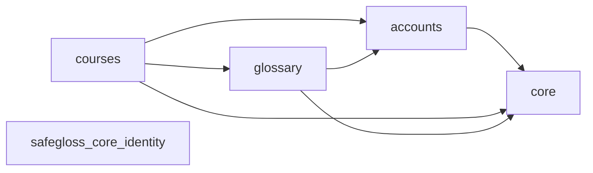

<!-- Generated by scripts/generate_documentation.py; do not edit. -->
# Generated application inventory

This reference is generated from the current SafeGloss Core repository.

## Component relationships

## Django applications

The default-runtime apps come from `config.settings`; packaged dormant apps are
distributed but are not selected by those settings.

| Application | Runtime status | Models |
|---|---|---:|
| `accounts` | default runtime | 1 |
| `core` | default runtime | 2 |
| `courses` | default runtime | 5 |
| `glossary` | default runtime | 3 |
| `safegloss_core_identity` | packaged dormant | 1 |

## Service modules

- `courses/access.py` — `active_exam_course_for_user`

## Management commands

- `seed_languages` (`core/management/commands/seed_languages.py`)
