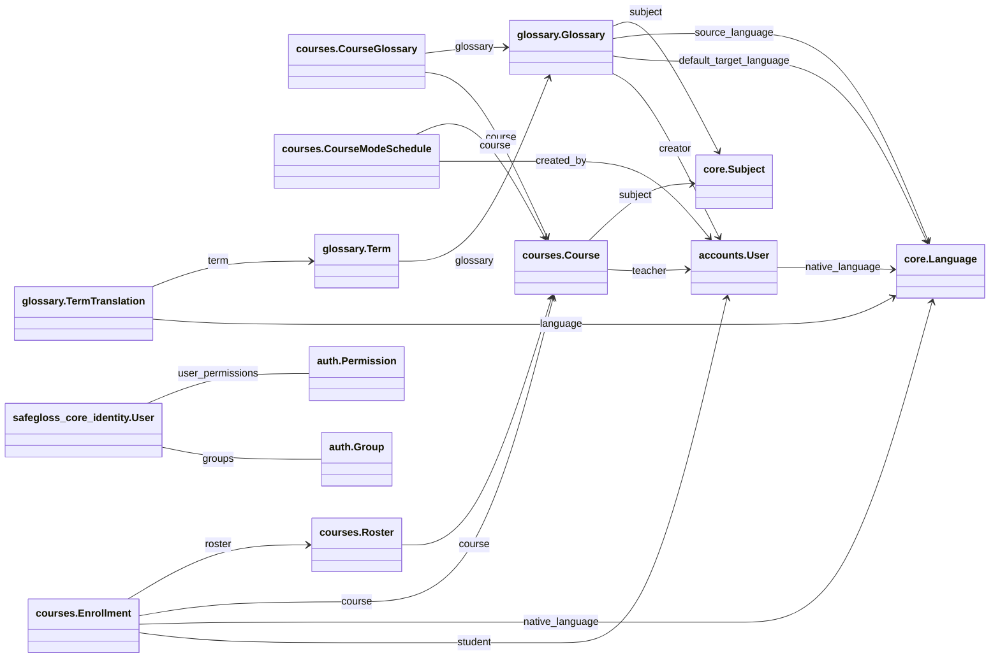

<!-- Generated by scripts/generate_documentation.py; do not edit. -->
# Generated data model

This field and relationship inventory is generated from SafeGloss Core model declarations.
It includes default-runtime apps and explicitly configured packaged dormant apps.
It describes repository structure, not production row counts or live data.

## Relationship diagram

## `accounts`

### `accounts.User`

| Field | Type | Relation target | Database null allowed |
|---|---|---|---|
| `email` | `EmailField` | — | no |
| `display_name` | `CharField` | — | no |
| `role` | `CharField` | — | no |
| `native_language` | `ForeignKey` | `core.Language` | yes |

## `core`

### `core.Language`

| Field | Type | Relation target | Database null allowed |
|---|---|---|---|
| `code` | `CharField` | — | no |
| `name` | `CharField` | — | no |
| `native_name` | `CharField` | — | no |

### `core.Subject`

| Field | Type | Relation target | Database null allowed |
|---|---|---|---|
| `name` | `CharField` | — | no |
| `slug` | `SlugField` | — | no |

## `courses`

### `courses.Course`

| Field | Type | Relation target | Database null allowed |
|---|---|---|---|
| `teacher` | `ForeignKey` | `accounts.User` | no |
| `name` | `CharField` | — | no |
| `description` | `TextField` | — | no |
| `subject` | `ForeignKey` | `core.Subject` | yes |
| `mode` | `CharField` | — | no |
| `exam_mode_until` | `DateTimeField` | — | yes |
| `join_code` | `CharField` | — | no |
| `created_at` | `DateTimeField` | — | no |
| `updated_at` | `DateTimeField` | — | no |

### `courses.CourseGlossary`

| Field | Type | Relation target | Database null allowed |
|---|---|---|---|
| `course` | `ForeignKey` | `courses.Course` | no |
| `glossary` | `ForeignKey` | `glossary.Glossary` | no |
| `linked_at` | `DateTimeField` | — | no |

### `courses.CourseModeSchedule`

| Field | Type | Relation target | Database null allowed |
|---|---|---|---|
| `course` | `ForeignKey` | `courses.Course` | no |
| `starts_at` | `DateTimeField` | — | no |
| `ends_at` | `DateTimeField` | — | no |
| `created_by` | `ForeignKey` | `accounts.User` | no |

### `courses.Enrollment`

| Field | Type | Relation target | Database null allowed |
|---|---|---|---|
| `course` | `ForeignKey` | `courses.Course` | no |
| `student` | `ForeignKey` | `accounts.User` | no |
| `roster` | `ForeignKey` | `courses.Roster` | yes |
| `native_language` | `ForeignKey` | `core.Language` | yes |
| `joined_at` | `DateTimeField` | — | no |
| `is_active` | `BooleanField` | — | no |

### `courses.Roster`

| Field | Type | Relation target | Database null allowed |
|---|---|---|---|
| `course` | `ForeignKey` | `courses.Course` | no |
| `name` | `CharField` | — | no |

## `glossary`

### `glossary.Glossary`

| Field | Type | Relation target | Database null allowed |
|---|---|---|---|
| `creator` | `ForeignKey` | `accounts.User` | no |
| `title` | `CharField` | — | no |
| `description` | `TextField` | — | no |
| `source_language` | `ForeignKey` | `core.Language` | no |
| `default_target_language` | `ForeignKey` | `core.Language` | no |
| `subject` | `ForeignKey` | `core.Subject` | yes |
| `is_public` | `BooleanField` | — | no |
| `created_at` | `DateTimeField` | — | no |
| `updated_at` | `DateTimeField` | — | no |

### `glossary.Term`

| Field | Type | Relation target | Database null allowed |
|---|---|---|---|
| `glossary` | `ForeignKey` | `glossary.Glossary` | no |
| `phrase` | `CharField` | — | no |
| `definition` | `TextField` | — | no |
| `example` | `TextField` | — | no |
| `part_of_speech` | `CharField` | — | no |
| `pronunciation_url` | `URLField` | — | no |
| `is_exam_approved` | `BooleanField` | — | no |
| `created_at` | `DateTimeField` | — | no |
| `updated_at` | `DateTimeField` | — | no |

### `glossary.TermTranslation`

| Field | Type | Relation target | Database null allowed |
|---|---|---|---|
| `term` | `ForeignKey` | `glossary.Term` | no |
| `language` | `ForeignKey` | `core.Language` | no |
| `text` | `CharField` | — | no |
| `example` | `TextField` | — | no |

## `safegloss_core_identity` — packaged dormant

### `safegloss_core_identity.User`

| Field | Type | Relation target | Database null allowed |
|---|---|---|---|
| `id` | `UUIDField` | — | no |
| `email` | `EmailField` | — | no |
| `display_name` | `CharField` | — | no |
| `groups` | `ManyToManyField` | `auth.Group` | no |
| `user_permissions` | `ManyToManyField` | `auth.Permission` | no |
